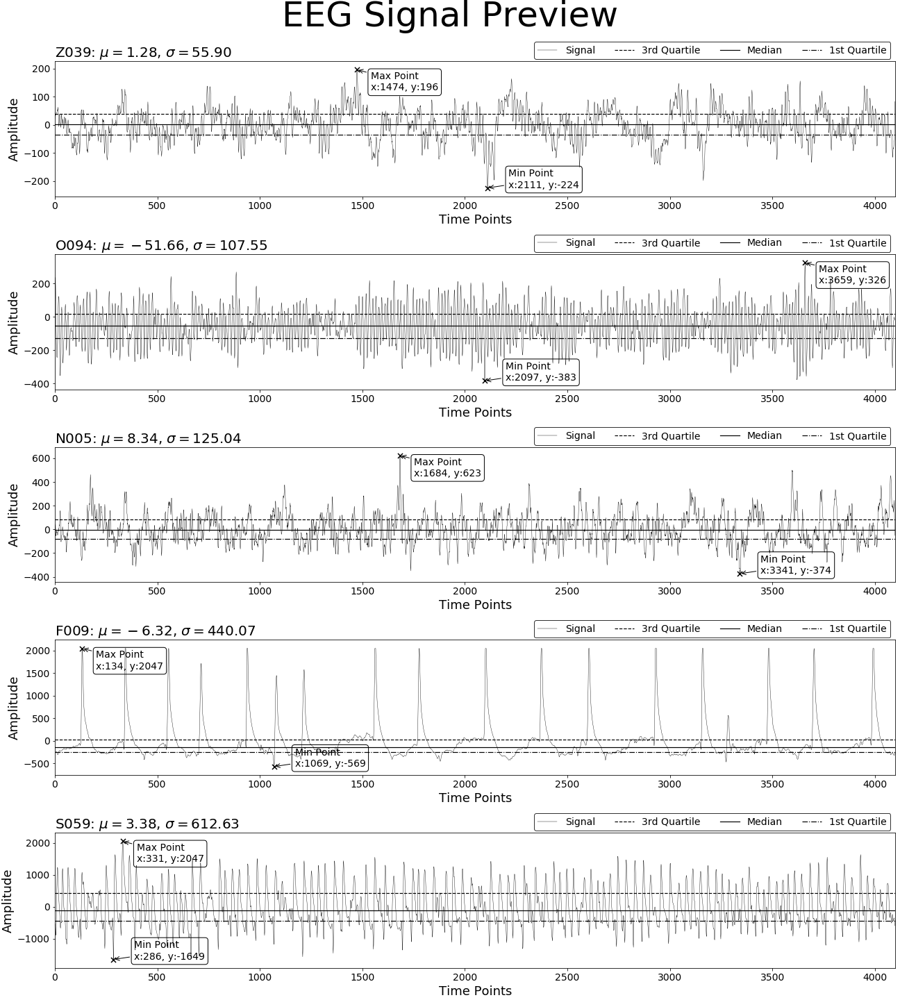

> - A collection of my accomplishments on data visualization
[TOC]
# 1. EEG_Signal_Preview
- Dataset: https://archive.ics.uci.edu/ml/datasets/eeg+database
- Tool: Numpy, Pandas, Matplotlib
- Plot design:
	1)	Choose the segment which have the maximum standard deviation to represent the whole dataset respectively.
	2)	Divide the whole figure into 5 rows and use each row for plot a line chart of the selected segment.
	3)	Add title which include the segment name, mean and standard deviation information to each plot.
	4)	Add xlabel, ylabel, and legend to each plot.
	5)	Add three horizontal lines which represent mean, 1st and 3rd quantile to the plot.
	6)	Add two annotation on the plot, one for the maximum amplitude point and another for minimum.
	7)	Show and save the figure.

